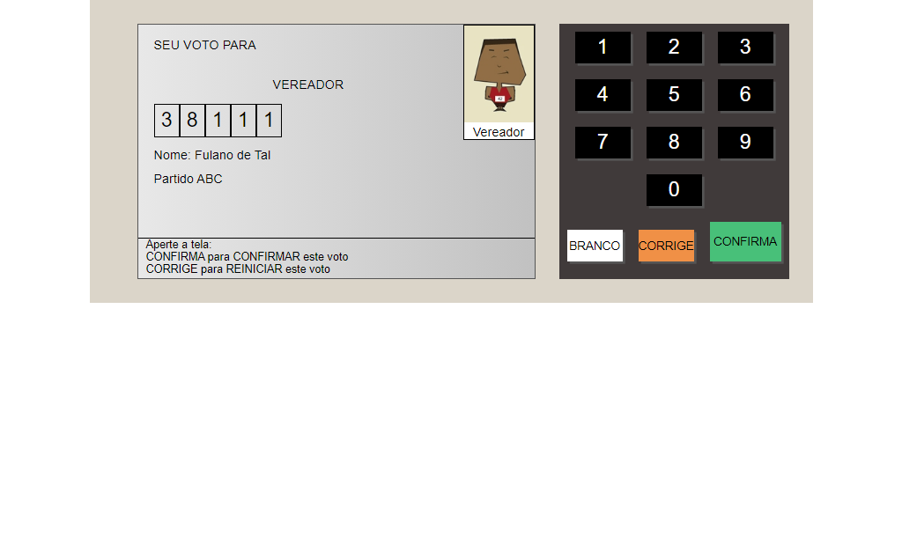

# Urna Eletrônica

> Urna

Esse é o projeto Urna Eletrônica criado no curso da B7Web.

[Clique para acessar](https://guimiiller.github.io/urna_eletronica/)

## 🚀 Tecnologias

- HTML
- CSS
- JavaScript
- Git e Github

## 💻 O que aprendi

- Aprendi a usar a função nextElementSibling para achar o elemento mais próximo
- Aprendi a salvar os votos dentro de um array

## 📨 Contato

- guilhermemillerblack@gmail.com